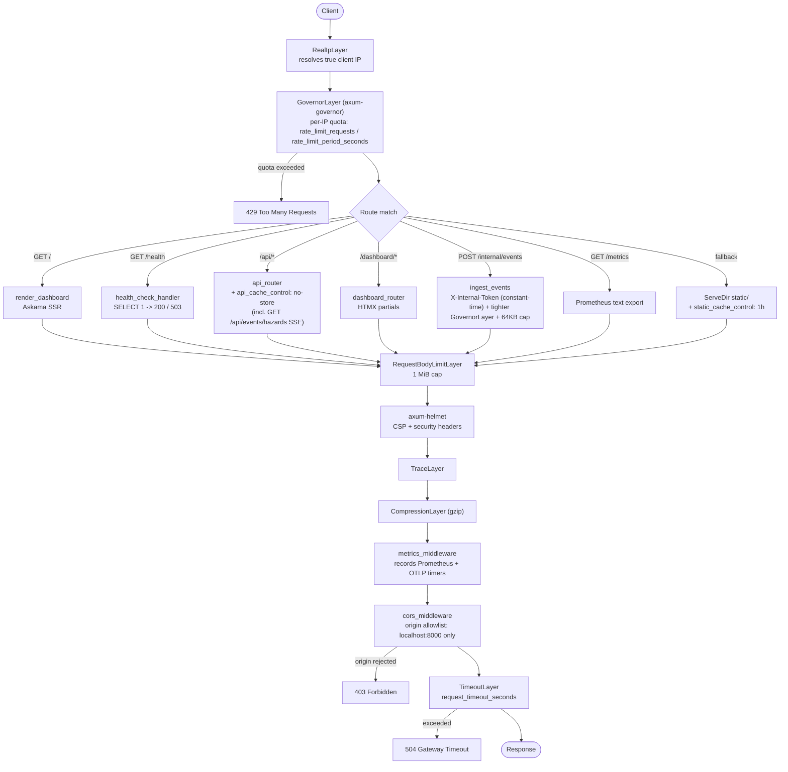
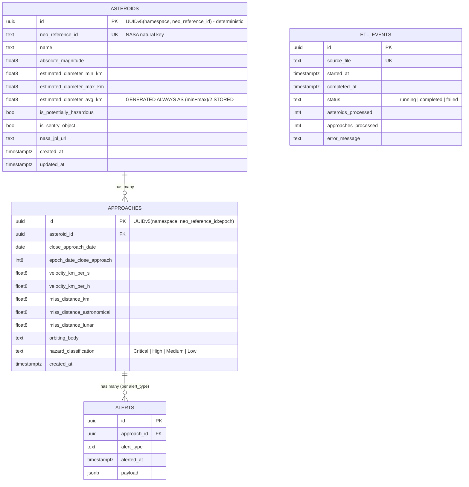

# Rustroid Sentinel

[](https://gitlab.com/AhmadZaweet/rustroid-sentinel/-/commits/master)


[](https://discord.gg/GHT55B3Mdp)
[](https://rustroid-sentinel.onrender.com/)

## Table of Contents

- [Overview](#-overview)
- [Discord Community](#-discord-community)
- [Key Features](#-key-features)
- [Architecture](#-architecture)
  - [Request Lifecycle](#request-lifecycle)
  - [Data Model](#data-model)
  - [Error Handling](#error-handling)
- [Project Structure](#-project-structure)
- [Environment Variables](#-environment-variables)
- [Getting Started](#-getting-started)
  - [Prerequisites](#-prerequisites)
  - [Local Development Setup](#-local-development-setup)
  - [Running with Docker](#-running-with-docker)
  - [Running the Examples](#-running-the-examples)
- [CLI Commands](#-cli-commands)
- [Rate Limiting & Security](#-rate-limiting--security)
- [Health Checks](#-health-checks)
- [Observability](#-observability)
- [CI/CD Pipeline](#-cicd-pipeline)
- [Testing](#-testing)
- [Contributing](#-contributing)
- [License](#-license)
- [Acknowledgments](#-acknowledgments)

---

## 📖 Overview

Rustroid Sentinel is a Rust/Tokio backend that pulls near-Earth object (NEO) data from NASA's NeoWs API, runs it through a hazard-classification pipeline, persists it to PostgreSQL, serves it through an Axum REST API and server-rendered HTMX dashboard, and pushes Discord alerts when a hazardous approach is detected.

The domain logic (fetch → classify → persist → alert) is intentionally small. The bulk of the engineering effort is in the layers around it:

- **Four independent binaries behind one CLI**, selected via Cargo feature flags (`api`, `alerting`, `metrics`, `etl`, plus the optional `pg-listen`) compiled in or out with `#[cfg(feature = "...")]` — see [`src/lib.rs`](src/lib.rs) and [`src/main.rs`](src/main.rs).
- **A streaming ETL pipeline** that never holds a full NASA response or a full batch file in memory: the extractor streams HTTP response bytes straight to a temp file ([`src/nasa/asteroid_neows/api.rs`](src/nasa/asteroid_neows/api.rs)), the loader streams NDJSON line-by-line in batches of 1,000 ([`src/cli/load.rs`](src/cli/load.rs)).
- **Deterministic UUIDv5 identity** derived from NASA's own natural keys, which turns every load into an idempotent, restart-safe `INSERT ... ON CONFLICT` instead of a "check-then-write" race ([`src/models/asteroid.rs`](src/models/asteroid.rs), [`src/models/approach.rs`](src/models/approach.rs)).
- **A layered security/observability middleware stack** on the Axum router — per-IP rate limiting, CSP headers, a hand-rolled CORS allowlist, request body caps, gzip compression, distributed tracing, and dual Prometheus/OTLP metrics — all composed as `tower` layers in [`src/server/router.rs`](src/server/router.rs).
- **A structured, per-module error taxonomy** (`ApiError`, `AlertError`, `DatabaseError`, `NasaApiError`, `MetricsError`), each a `thiserror` enum with its own `is_retryable()`/`status_code()` classification, converted at the HTTP boundary into a consistent JSON envelope.

## 💬 Discord Community

Join the official [Rustroid Sentinel Discord Server](https://discord.gg/GHT55B3Mdp) to connect with fellow developers, discuss space data pipelines, and receive real-time hazard alerts directly.

## 🎯 Key Features

- **Compile-time feature isolation** — `api`, `alerting`, `metrics`, and `etl` are Cargo features that gate entire modules (`#[cfg(feature = "api")] pub mod api;` in [`src/lib.rs`](src/lib.rs)) and CLI subcommands (`#[cfg(feature = "alerting")] Alert(AlertArgs)` in [`src/main.rs`](src/main.rs)), so a metrics-only or alerting-only binary can be built without pulling in Axum or Serenity.
- **Layered configuration** — `config/config.toml` (optional base) → `config/{RUN_ENV}.toml` (required, defaults to `development`) → `SERVICE__`-prefixed environment variables, merged by the `config` crate with typed deserialization errors surfaced as `ServiceConfigError` variants ([`src/settings.rs`](src/settings.rs)).
- **Secret redaction by construction** — `DatabaseConfig`, `NasaConfig`, `DiscordConfig`, `PrometheusConfig`, and `GrafanaCloudPrometheusConfig` each hand-implement `Debug` to redact URLs/keys/tokens, so the `info!(config = ?settings, ...)` startup log in [`src/main.rs`](src/main.rs) can never leak a credential.
- **Per-IP rate limiting via `axum-governor`** — a `GovernorLayer` with a `PeerIp` extractor and `RealIpLayer` enforces `rate_limit_requests` per `rate_limit_period_seconds` (config-driven, default 100/60s), returning `429` once the quota is exhausted ([`src/server/router.rs`](src/server/router.rs)).
- **CSP + security headers via `axum-helmet`** — an explicit `Content-Security-Policy` allowlist (self, Tailwind CDN, jsDelivr, unpkg for htmx/lucide, Google Fonts) rather than a wildcard policy ([`src/server/router.rs`](src/server/router.rs)).
- **Hand-rolled CORS allowlist** — `cors_middleware` only allows `http://localhost:8000` / `http://127.0.0.1:8000` origins (or no `Origin` header, for non-browser clients) and restricts allowed methods to `GET`; anything else gets `403` ([`src/server/middleware.rs`](src/server/middleware.rs)).
- **Differentiated cache-control policy** — API routes get `no-store, no-cache, must-revalidate`; static assets get `public, max-age=3600`, applied via two separate `middleware::from_fn` layers rather than one blanket policy ([`src/server/middleware.rs`](src/server/middleware.rs)).
- **1 MiB request body cap** via `RequestBodyLimitLayer` to bound memory use from oversized request bodies ([`src/server/router.rs`](src/server/router.rs)).
- **Graceful shutdown** — `tokio::select!` over `SIGINT`/`SIGTERM` (Unix) with `axum::serve(...).with_graceful_shutdown(...)`; if signal-handler installation fails, it logs and blocks forever rather than silently exiting ([`src/server/shutdown.rs`](src/server/shutdown.rs)).
- **Streaming NASA feed extraction** — `NeoWsApi::get_feed` streams the HTTP response body straight to a temp file and deserializes from disk, rather than buffering the whole JSON payload in memory; a `tokio::sync::Semaphore` bounds concurrent NASA requests to `max_concurrent_requests` ([`src/nasa/asteroid_neows/api.rs`](src/nasa/asteroid_neows/api.rs)).
- **Retrying, TLS-strict HTTP client** — `reqwest-retry`'s `ExponentialBackoff` wraps every outbound call, certificate/hostname validation is explicitly enforced (`danger_accept_invalid_certs(false)`), and redirects are capped at 5 ([`src/api/client.rs`](src/api/client.rs)).
- **Rule-based hazard classification** — a pure function scores each approach Critical/High/Medium/Low from PHA designation, diameter, velocity, and miss distance, independently unit-tested against each threshold boundary ([`src/transform/mod.rs`](src/transform/mod.rs)).
- **Bulk UPSERT via `UNNEST`** — asteroid/approach batches are written with a single `INSERT ... SELECT * FROM UNNEST($1::uuid[], ...)` per 1,000-row chunk inside one transaction, instead of row-by-row inserts ([`src/database/repository.rs`](src/database/repository.rs)).
- **Idempotent alerting** — a `LEFT JOIN alerts ... WHERE al.id IS NULL` query means an approach is only ever alerted once per channel, backed by a `UNIQUE (approach_id, alert_type)` constraint, so a crashed/retried alert run can't double-notify ([`src/alert/service.rs`](src/alert/service.rs), [`migrations/002_create_alerts_table.sql`](migrations/002_create_alerts_table.sql)).
- **Generated column for average diameter** — `estimated_diameter_avg_km` is a Postgres `GENERATED ALWAYS AS ((min+max)/2.0) STORED` column, so the average is computed once at the database and can never drift from `min`/`max` ([`migrations/003_add_diameter_avg_column.sql`](migrations/003_add_diameter_avg_column.sql)).
- **Dual metrics pipeline with fallback chain** — a Prometheus registry is scraped at `/metrics`; the same process also pushes OTLP metrics to Grafana Cloud every 10 seconds. The dashboard's live-metrics widget queries Grafana Cloud Prometheus first, falls back to a legacy `query_url`, then falls back to database-derived counts if neither is configured ([`src/metrics/otlp.rs`](src/metrics/otlp.rs), [`src/metrics/mod.rs`](src/metrics/mod.rs)).
- **HTMX partial SSR** — the dashboard's table, ETL history, velocity chart, and metrics widget are independently refreshable Askama templates served from dedicated `/dashboard/*` endpoints, not a single monolithic page render ([`src/api/handlers/dashboard.rs`](src/api/handlers/dashboard.rs), [`templates/partials/`](templates/partials/)).
- **Live SSE hazard event stream** — `GET /api/events/hazards` fans out newly-loaded Critical/High approaches over Server-Sent Events with a 15s keep-alive, a typed `lagged` event (with skip count) for subscribers that fall behind instead of a silent gap, and a configurable subscriber cap (`503` past `max_hazard_subscribers`). The dashboard subscribes via `hx-ext="sse"` and re-fetches the approach table live, no polling ([`src/api/handlers/hazard_events_sse.rs`](src/api/handlers/hazard_events_sse.rs), [`src/events/`](src/events/)).
- **Constant-time-authenticated internal ingest webhook** — `POST /internal/events` accepts the `load` command's newly-inserted hazard events (or, optionally, Postgres `NOTIFY` payloads via the `pg-listen` feature) behind a shared secret compared in constant time, a tightened per-route rate limit, and a 64 KB body cap, kept outside the public `/api` router entirely ([`src/api/handlers/internal_events.rs`](src/api/handlers/internal_events.rs)).
- **Storage-budget-aware retention** — a `prune` CLI command deletes `approaches`/`etl_events` rows past a configurable age (while always keeping a minimum row floor for the dashboard), and the metrics widget tracks `pg_database_size` against a configurable budget (Neon free tier's 512 MB by default) with a warn/critical gauge ([`src/database/retention.rs`](src/database/retention.rs), [`src/cli/prune.rs`](src/cli/prune.rs), [`src/metrics/types.rs`](src/metrics/types.rs)).
- **Multi-stage, layer-cached Docker build** — `cargo-chef` separates the dependency-compile layer from the source-compile layer, the runtime stage is a minimal Alpine image running as a non-root `sentinel` user with a container-level `HEALTHCHECK` hitting `/api/health` ([`Dockerfile`](Dockerfile)).

## 🏗 Architecture

### Request Lifecycle

The diagram below mirrors the layer declaration order in [`src/server/router.rs`](src/server/router.rs):



### Data Model



`APPROACHES` has a `UNIQUE (asteroid_id, epoch_date_close_approach)` constraint so re-running the loader on the same source data is a no-op (`ON CONFLICT ... DO NOTHING`). `ALERTS` has `UNIQUE (approach_id, alert_type)` for the same reason. `ETL_EVENTS` tracks pipeline runs by `source_file` and is not foreign-keyed to the other tables — it's an audit log, not a domain relation. Indexes exist on `neo_reference_id`, `is_potentially_hazardous`, `asteroid_id`, `close_approach_date`, and `hazard_classification` ([`migrations/001_create_tables.sql`](migrations/001_create_tables.sql)).

Hazard events (`Critical`/`High` approaches, published to the SSE stream) are not a table — the `INSERT ... ON CONFLICT ... RETURNING id` in `AsteroidRepository::upsert_batch` tells the loader exactly which approach rows were newly inserted (not deduped), and those are turned into ephemeral `HazardEvent`s fanned out over an in-process `tokio::sync::broadcast` channel ([`src/events/mod.rs`](src/events/mod.rs)); the database row remains the source of truth, the event is just a low-latency notification.

### Error Handling

Each module owns a `thiserror` enum ([`src/api/error.rs`](src/api/error.rs), [`src/alert/error.rs`](src/alert/error.rs), [`src/database/error.rs`](src/database/error.rs), [`src/nasa/error.rs`](src/nasa/error.rs), [`src/metrics/error.rs`](src/metrics/error.rs)), each exposing `is_retryable()` and, for `ApiError`, a `status_code()` mapping used by its `IntoResponse` impl. Application-level code (CLI commands, `main.rs`) uses `anyhow::Result` with `.context()` instead of propagating the typed enums directly. `ApiError` maps to HTTP status as:

| `ApiError` variant | HTTP Status |
| --- | --- |
| `NotFound` | 404 |
| `InvalidQuery`, `InvalidBody` | 400 |
| `Unauthorized` | 401 |
| `Forbidden` | 403 |
| `Timeout` | 504 |
| `Unavailable` | 503 |
| `Database`, `Serialization`, `Internal`, `Metrics` | 500 |

Every `ApiError` response is wrapped in the same `ApiResponse<T> { success, data, error }` JSON envelope used by successful responses ([`src/api/types.rs`](src/api/types.rs)).

## 📂 Project Structure

```text
rustroid-sentinel/
├── src/
│   ├── lib.rs                  # Public library interface; feature-gated module re-exports
│   ├── main.rs                 # CLI entry point; dispatches extract/transform/load/alert/serve
│   ├── api/                    # Axum handlers, routes, DTOs, Askama templates, HTTP client
│   │   └── handlers/           # One handler module per endpoint (stats, velocity, approaches, etl_runs, health, dashboard)
│   ├── alert/                  # Hazard-alert dispatch: Discord webhook client + idempotent alert service
│   ├── cli/                    # extract / transform / load / prune / alert subcommand implementations
│   ├── database/                # Connection pool, migrations runner, write repository, read (dashboard) repository, retention/pruning
│   ├── events/                  # HazardEvent + broadcast channel; optional pg-listen NOTIFY forwarder
│   ├── metrics/                 # Prometheus registry, OTLP exporter, Axum metrics middleware, Grafana Cloud query client, storage-budget gauge
│   ├── models/                  # Asteroid / Approach domain structs, hazard classification enum
│   ├── nasa/                    # Typed NeoWs API client + response DTOs
│   ├── server/                  # Router assembly, middleware, shared AppState, graceful shutdown
│   ├── settings.rs              # Layered config loading (files + SERVICE__ env vars)
│   ├── transform/               # NASA DTO -> domain model conversion + hazard classification rules
│   └── error.rs                 # Top-level Error enum, re-exports module error types
├── migrations/                  # Raw SQL migrations, executed in order via sqlx::raw_sql on startup
├── static/                      # CSS/JS served via tower-http ServeDir
├── templates/                   # Askama templates (full page + HTMX partials)
├── tests/                       # Integration/e2e tests: wiremock (NASA API), bollard (disposable Postgres)
├── examples/                    # Standalone runnable examples (api_client, basic_etl, custom_alert)
├── .gitlab/ci/                  # Split CI job definitions included by .gitlab-ci.yml
├── Dockerfile                   # cargo-chef multi-stage build -> Alpine runtime
├── docker-compose.yml           # App + Postgres for local Docker Compose runs
├── deny.toml                    # cargo-deny license/advisory policy (run manually; not yet wired into CI)
└── .env.example                 # Environment variable scaffolding
```

## ⚙️ Environment Variables

Configuration is loaded by [`src/settings.rs`](src/settings.rs): `config/config.toml` (optional) → `config/{RUN_ENV}.toml` (required) → environment variables prefixed `SERVICE__` with `__` as the nesting separator. `RUN_ENV` itself is read directly (not `SERVICE__`-prefixed) and defaults to `development`.

Fields without a `#[serde(default)]` in the corresponding config struct are **required** — they must come from a TOML file or the environment, or startup fails with a `ServiceConfigError::Deserialize`.

**Database** (`SERVICE__DATABASE__…`)

| Variable | Required | Description |
| --- | --- | --- |
| `SERVICE__DATABASE__URL` | Yes | PostgreSQL connection string (pooled endpoint, e.g. Neon's `-pooler`) |
| `SERVICE__DATABASE__LISTEN_URL` | No | Direct (non-pooler) connection string, required only by the `pg-listen` feature — PgBouncer transaction-mode pooling doesn't support `LISTEN` |
| `SERVICE__DATABASE__MAX_CONNECTIONS` | Yes | Max pool size |
| `SERVICE__DATABASE__MIN_CONNECTIONS` | Yes | Min idle connections |
| `SERVICE__DATABASE__CONNECT_TIMEOUT_SECONDS` | Yes | Pool acquire timeout |

**NASA NeoWs client** (`SERVICE__NASA__…`)

| Variable | Required | Default | Description |
| --- | --- | --- | --- |
| `SERVICE__NASA__API_KEY` | Yes | — | NASA Open API key (get one at api.nasa.gov) |
| `SERVICE__NASA__BASE_URL` | Yes | — | NASA API base URL |
| `SERVICE__NASA__TIMEOUT_SECONDS` | Yes | — | Per-request timeout |
| `SERVICE__NASA__MAX_RETRIES` | Yes | — | Exponential-backoff retry count |
| `SERVICE__NASA__RETRY_DELAY_MS` | Yes | — | Max backoff delay |
| `SERVICE__NASA__MAX_CONCURRENT_REQUESTS` | No | `5` | Semaphore-bounded concurrent NASA requests |

**Discord alerting** (`SERVICE__DISCORD__…`)

| Variable | Required | Description |
| --- | --- | --- |
| `SERVICE__DISCORD__WEBHOOK_URL` | Yes (may be empty) | Webhook URL; an empty string makes `DiscordClient::send_alert` a no-op rather than an error |
| `SERVICE__DISCORD__TIMEOUT_SECONDS` | Yes | Webhook request timeout |
| `SERVICE__DISCORD__MAX_RETRIES` | Yes | Webhook retry count |

**Outbound HTTP client** (`SERVICE__HTTP__…`)

| Variable | Required | Default | Description |
| --- | --- | --- | --- |
| `SERVICE__HTTP__USER_AGENT` | Yes | — | User-Agent sent on all outbound requests |
| `SERVICE__HTTP__TIMEOUT_SECONDS` | Yes | — | Overall request timeout |
| `SERVICE__HTTP__CONNECT_TIMEOUT_SECONDS` | Yes | — | Connect-phase timeout |
| `SERVICE__HTTP__POOL_IDLE_TIMEOUT_SECONDS` | Yes | — | Idle connection lifetime |
| `SERVICE__HTTP__POOL_MAX_IDLE_PER_HOST` | Yes | — | Idle connections kept per host |
| `SERVICE__HTTP__ENABLE_GZIP` | No | `true` | Gzip compression for outbound requests |

**ETL pipeline** (`SERVICE__ETL__…`)

| Variable | Required | Description |
| --- | --- | --- |
| `SERVICE__ETL__FETCH_INTERVAL_HOURS` | Yes | Interval between scheduled fetch runs |
| `SERVICE__ETL__LOOKBACK_DAYS` | Yes | Days in the past to include per run |
| `SERVICE__ETL__LOOKAHEAD_DAYS` | Yes | Days in the future to include per run |
| `SERVICE__ETL__ALERT_COOLDOWN_HOURS` | Yes | Cooldown before re-alerting the same event |
| `SERVICE__ETL__BATCH_SIZE` | Yes | Records per DB persistence batch |
| `SERVICE__ETL__RETENTION__APPROACH_RETENTION_YEARS` | No | Default `5` — `prune` deletes `approaches` older than this |
| `SERVICE__ETL__RETENTION__ETL_EVENT_RETENTION_DAYS` | No | Default `30` — `prune` deletes `etl_events` older than this |
| `SERVICE__ETL__RETENTION__ETL_EVENTS_KEEP_MIN` | No | Default `50` — minimum `etl_events` rows kept regardless of age |
| `SERVICE__ETL__INTERNAL_EVENTS_URL` | No | `POST /internal/events` webhook URL the `load` command notifies after a run; unset skips publishing entirely (the database stays the source of truth either way) |

**HTTP server** (`SERVICE__SERVER__…`)

| Variable | Required | Default | Description |
| --- | --- | --- | --- |
| `SERVICE__SERVER__REQUEST_TIMEOUT_SECONDS` | No | `300` | `TimeoutLayer` duration (→ 504) |
| `SERVICE__SERVER__RATE_LIMIT_REQUESTS` | No | `100` | `GovernorLayer` quota per period |
| `SERVICE__SERVER__RATE_LIMIT_PERIOD_SECONDS` | No | `60` | `GovernorLayer` quota window |
| `SERVICE__SERVER__MAX_HAZARD_SUBSCRIBERS` | No | `100` | Max concurrent `GET /api/events/hazards` SSE connections (→ 503 past cap) |
| `SERVICE__SERVER__INTERNAL_EVENT_RATE_LIMIT_REQUESTS` | No | `30` | Tighter per-minute `GovernorLayer` quota applied only to `POST /internal/events` |

**Internal event ingest** (read directly, not `SERVICE__`-prefixed — never a committed config file)

| Variable | Required | Description |
| --- | --- | --- |
| `INTERNAL_EVENT_TOKEN` | Yes (when `api` feature is on) | Shared secret compared in constant time against `X-Internal-Token` on `POST /internal/events`; the server **fails to start** if unset. The `load` command (and any other publisher) sends the same value. |

**Metrics** (`SERVICE__PROMETHEUS__…`, `SERVICE__GRAFANA_CLOUD_PROMETHEUS__…`) — both sections are fully optional; omit them entirely to run with local `/metrics` scraping only.

| Variable | Default | Description |
| --- | --- | --- |
| `SERVICE__PROMETHEUS__URL` | `""` | OTLP push endpoint (e.g. Grafana Cloud OTLP gateway) |
| `SERVICE__PROMETHEUS__QUERY_URL` | unset | Legacy Prometheus query API used as a fallback for the dashboard metrics widget |
| `SERVICE__PROMETHEUS__USERNAME` | `""` | Basic-auth user for OTLP push |
| `SERVICE__PROMETHEUS__TOKEN` | `""` | Basic-auth token for OTLP push |
| `SERVICE__PROMETHEUS__INTERVAL_SECONDS` | `60` | OTLP push interval |
| `SERVICE__GRAFANA_CLOUD_PROMETHEUS__URL` | `""` | Grafana Cloud Prometheus query API URL (preferred source for the dashboard widget) |
| `SERVICE__GRAFANA_CLOUD_PROMETHEUS__INSTANCE_ID` | `""` | Grafana Cloud instance ID (basic-auth user) |
| `SERVICE__GRAFANA_CLOUD_PROMETHEUS__TOKEN` | `""` | Grafana Cloud API token (basic-auth password) |

> **Note:** `.env.example` also lists `SERVICE__SERVER__CACHE__ENABLED`. There is no `cache` field on `ServerConfig` and no response caching is currently implemented — it's a placeholder for the design captured in [`docs/CACHING_PLAN.md`](docs/CACHING_PLAN.md). Setting it currently has no effect.

Service identity fields (`name`, `env`, `host`, `port`, `log_level`) are also overridable via `SERVICE__SERVICE__NAME`, `SERVICE__SERVICE__ENV`, `SERVICE__SERVICE__HOST`, `SERVICE__SERVICE__PORT`, `SERVICE__SERVICE__LOG_LEVEL`, but in practice these are set once per environment in `config/development.toml` / `config/production.toml` rather than per-deploy.

## 🚀 Getting Started

### 📦 Prerequisites

| Tool | Purpose | Recommended Version |
| --- | --- | --- |
| `Rust` | Systems programming language | `1.95+` (edition 2024) |
| `Cargo` | Rust package manager | latest |
| `git` | Version control | latest |
| `Docker` | Containerization platform (optional) | latest |
| `PostgreSQL` | Relational database (for local dev) | `14+` |

### 🖥️ Local Development Setup

1. **Clone the repository**

   ```bash
   git clone https://gitlab.com/AhmadZaweet/rustroid-sentinel.git
   cd rustroid-sentinel
   ```

2. **Set up environment variables**

   ```bash
   cp .env.example .env
   ```

   Fill in at minimum `SERVICE__DATABASE__URL` and `SERVICE__NASA__API_KEY`. See [Environment Variables](#-environment-variables).

3. **Run the application**

   ```bash
   cargo run -- serve
   ```

   `api`, `alerting`, `metrics`, and `etl` are all default Cargo features, so a plain `cargo run` builds everything. Migrations run automatically on startup ([`src/database/mod.rs`](src/database/mod.rs) `run_migrations`). The server listens on `http://localhost:8000` by default (`config/config.toml`).

   To run migrations manually instead: `sqlx migrate run --database-url $SERVICE__DATABASE__URL` (requires `sqlx-cli`, in `[dev-dependencies]`).

### 🐳 Running with Docker

`docker-compose.yml` wires the app to a local Postgres 17 container with a healthcheck-gated startup:

```bash
docker compose up --build
```

Or standalone against an external database:

```bash
cp .env.example .env   # point SERVICE__DATABASE__URL at your database
docker build -t rustroid-sentinel:latest .
docker run -d -p 8000:8000 --env-file .env rustroid-sentinel:latest
```

The image entrypoint is `rustroid-sentinel serve`; override the CMD to run ETL subcommands instead (this is exactly what the scheduled GitLab CI `etl_pipeline` job does against the built image).

### 🧪 Running the Examples

```bash
cargo run --example api_client    # hits a running server's /api endpoints
cargo run --example basic_etl     # shells out through extract -> transform -> load
cargo run --example custom_alert  # sends one Discord embed using your configured webhook
```

## 🛠 CLI Commands

| Command | Feature required | Description |
| --- | --- | --- |
| `rustroid-sentinel extract [-s START] [-e END] [-o DIR] [-b BATCH_SIZE] [-f] [--dry-run]` | — | Fetches NEO data from NASA in date-range batches, writes raw JSON to `data/raw/` |
| `rustroid-sentinel transform [-i DIR] [-o DIR] [-f] [--dry-run]` | — | Converts raw JSON into domain models with hazard classification, writes NDJSON to `data/transformed/` |
| `rustroid-sentinel load [-i DIR] [-f] [--dry-run]` | — | Streams NDJSON into PostgreSQL via batched `UPSERT`s, tracked in `etl_events`; publishes newly-inserted Critical/High approaches to `internal_events_url` if configured (best-effort, never fails the run) |
| `rustroid-sentinel alert` | `alerting` | Finds unalerted hazardous approaches and sends Discord embeds |
| `rustroid-sentinel prune` | — | Deletes `approaches`/`etl_events` rows past the configured retention window (`etl.retention.*`), keeping the database under its storage budget |
| `rustroid-sentinel serve` | `api` | Runs migrations, then starts the Axum HTTP server |

All six subcommands are defined in [`src/main.rs`](src/main.rs); `alert` and `serve` are behind `#[cfg(feature = "...")]` and disappear from the binary if that feature is disabled at build time.

## 🔒 Rate Limiting & Security

| Mechanism | Where | Behavior |
| --- | --- | --- |
| Per-IP rate limit | `axum-governor` `GovernorLayer` ([`router.rs`](src/server/router.rs)) | `rate_limit_requests` per `rate_limit_period_seconds` per client IP (from `PeerIp` via `RealIpLayer`); `429` when exceeded |
| Internal webhook auth | `POST /internal/events` ([`internal_events.rs`](src/api/handlers/internal_events.rs)) | `X-Internal-Token` compared byte-for-byte in constant time against `INTERNAL_EVENT_TOKEN`; `401` on mismatch or missing header. Route is outside the `/api` router and not linked from the dashboard. Own tighter `GovernorLayer` bucket (`internal_event_rate_limit_requests`, default 30/min) and a 64 KB body cap layered inside the global 1 MiB limit |
| SSE subscriber cap | `GET /api/events/hazards` ([`hazard_events_sse.rs`](src/api/handlers/hazard_events_sse.rs)) | `503` once `max_hazard_subscribers` concurrent streams are held, since each is a live task |
| CSP + security headers | `axum-helmet` ([`router.rs`](src/server/router.rs)) | Explicit `script-src`/`style-src`/`font-src`/`img-src`/`connect-src` allowlist (self + named CDNs), not a wildcard |
| CORS | Custom `cors_middleware` ([`middleware.rs`](src/server/middleware.rs)) | Only `localhost:8000` / `127.0.0.1:8000` origins (or none) allowed; `GET` only; others get `403` |
| Request body size | `RequestBodyLimitLayer` ([`router.rs`](src/server/router.rs)) | Hard cap at 1 MiB |
| TLS verification | `reqwest` client config ([`api/client.rs`](src/api/client.rs)) | `danger_accept_invalid_certs(false)`, `danger_accept_invalid_hostnames(false)` on all outbound calls |
| Redirect limit | `reqwest` client config ([`api/client.rs`](src/api/client.rs)) | Max 5 redirects followed |
| Secret redaction | Manual `Debug` impls ([`settings.rs`](src/settings.rs)) | DB URL, NASA key, Discord webhook, Prometheus/Grafana tokens never appear in logs |
| Request timeout | `TimeoutLayer` ([`router.rs`](src/server/router.rs)) | `request_timeout_seconds` → `504 Gateway Timeout` |
| Dependency policy | [`deny.toml`](deny.toml) | Denies GPL/AGPL licenses and known-insecure crates (e.g. `openssl`); run via `cargo deny check` — not currently a CI gate |

## ❤️ Health Checks

Two distinct health endpoints exist with different semantics:

| Endpoint | Handler | Status code behavior | Used by |
| --- | --- | --- | --- |
| `GET /health` | `health_check_handler` ([`server/middleware.rs`](src/server/middleware.rs)) | Runs `SELECT 1`; returns **503** if the database is unreachable, else **200** | Docker `HEALTHCHECK`, load balancers |
| `GET /api/health` | `health` ([`api/handlers/health.rs`](src/api/handlers/health.rs)) | Always **200**; `database_connected: bool` is reported in the JSON body instead | Dashboard health widget |

The Docker image's own `HEALTHCHECK` (in [`Dockerfile`](Dockerfile)) polls `/api/health` every 30s.

## 📊 Observability

- **Tracing**: `tracing` + `tracing-subscriber` with `EnvFilter`, level controlled by `SERVICE__SERVICE__LOG_LEVEL` / `config/*.toml`; `TraceLayer` on every HTTP request.
- **Prometheus**: `HTTP_REQUESTS_TOTAL`, `HTTP_REQUEST_DURATION` (histogram, ms-to-10s buckets), `DATABASE_QUERIES_TOTAL`, `DATABASE_QUERY_DURATION` — all registered in [`src/metrics/registry.rs`](src/metrics/registry.rs), exposed at `GET /metrics` in Prometheus text format.
- **OTLP push**: the same request/query events are also recorded as OpenTelemetry counters/histograms and pushed to Grafana Cloud every 10 seconds when `SERVICE__PROMETHEUS__URL` is set ([`src/metrics/otlp.rs`](src/metrics/otlp.rs)).
- **Dashboard metrics widget**: `GET /api/metrics/summary` and `GET /dashboard/metrics` resolve metrics through a fallback chain — Grafana Cloud Prometheus query API → legacy `SERVICE__PROMETHEUS__QUERY_URL` → local Prometheus registry, always merged with live database counts ([`src/metrics/mod.rs`](src/metrics/mod.rs) `get_metrics_summary`).

## 🔄 CI/CD Pipeline

Defined in [`.gitlab-ci.yml`](.gitlab-ci.yml) and [`.gitlab/ci/`](.gitlab/ci/):

| Stage | Job | Trigger | What runs |
| --- | --- | --- | --- |
| `quality` | `compilation-check` | Merge request | `cargo fetch && cargo check --workspace --all-targets --locked` |
| `quality` | `formatting-check` | Merge request | `cargo fmt --all -- --check` then `cargo clippy --workspace --all-targets --locked -- -D warnings` |
| `build` | `docker_build` | Push to default branch | `docker buildx build` with registry-backed layer cache, pushes `:latest` and `:$CI_COMMIT_SHORT_SHA` |
| `run-etl-pipeline` | `etl_pipeline` | Scheduled pipeline | Runs `extract → transform → load → alert` inside the just-built image |

`cargo test` is **not** currently run as a CI stage — tests are run locally / via `.pre-commit-config.yaml` hooks, which also run `cargo fmt`, `cargo clippy --all-features -- -D warnings`, and `cargo check --release` before each commit.

## 🧪 Testing

Test dependencies actually exercised in the test suite:

- **`wiremock`** — mocks the NASA NeoWs HTTP API for both unit tests ([`src/nasa/asteroid_neows/api.rs`](src/nasa/asteroid_neows/api.rs)) and the end-to-end pipeline test ([`tests/e2e/full_pipeline.rs`](tests/e2e/full_pipeline.rs)).
- **`bollard`** — spins up a disposable `postgres:17-alpine` Docker container per integration test run for isolated database testing ([`tests/common/database.rs`](tests/common/database.rs)); chosen specifically over `testcontainers` due to a transitive RUSTSEC advisory (see the comment in [`Cargo.toml`](Cargo.toml)).
- Standard `#[tokio::test]` / `#[test]` unit tests are colocated with the code they cover throughout `src/`.

`mockall`, `proptest`, `insta`, and `assert-json-diff` are declared in `[dev-dependencies]` but are not currently used by any test.

```bash
# Run all tests
cargo test

# Run only unit tests (in src/)
cargo test --lib

# Run tests with output
cargo test -- --nocapture

# Generate coverage report (requires cargo-llvm-cov)
cargo llvm-cov --html --open
```

## 🤝 Contributing

Contributions are welcome! Please follow these steps:

1. **Fork the repository.**
2. **Create a new feature branch:** `git checkout -b feature/your-feature-name`
3. **Make your changes.**
4. **Commit your changes:** `git commit -m 'Add some feature'`
5. **Push to the branch:** `git push origin feature/your-feature-name`
6. **Submit a Merge Request.**

Please ensure tests are updated, follow `rustfmt` style and verify code with `cargo clippy`, and document public APIs with `///` and `# Errors` comments.

## 📜 License

This project is licensed under the **GNU General Public License v3.0**. See the [LICENSE](LICENSE) file for the full license text.

## 🙌 Acknowledgments

- [Rust](https://www.rust-lang.org/) - A language empowering everyone to build reliable and efficient software.
- [Axum](https://github.com/tokio-rs/axum) - Ergonomic web framework built with Tokio.
- [SQLx](https://github.com/launchbadge/sqlx) - Async Rust SQL toolkit with compile-time checked queries.
- [OpenTelemetry](https://opentelemetry.io/) - Standardization for high-quality, ubiquitous, and portable telemetry.
- [Serenity](https://github.com/serenity-rs/serenity) - A Rust library for the Discord API.
- [NASA Open APIs](https://api.nasa.gov/) - NeoWs API powers the NEO data for this platform.
